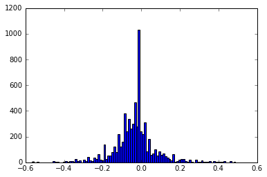
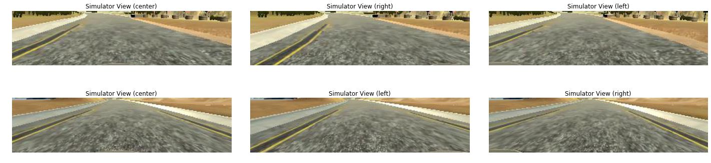
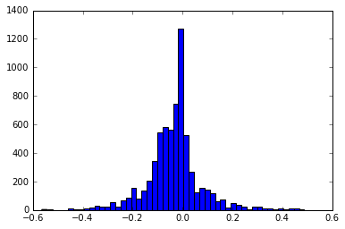
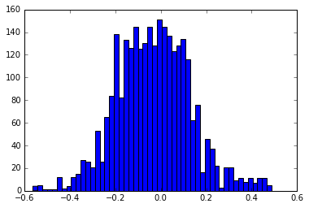
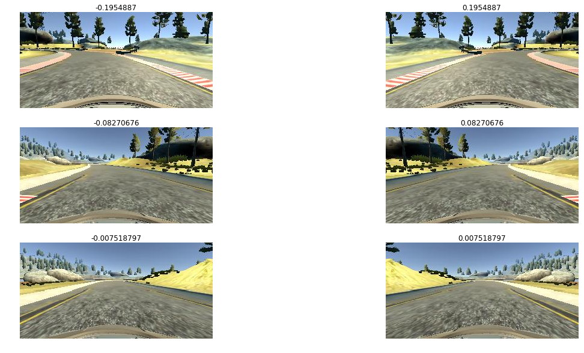
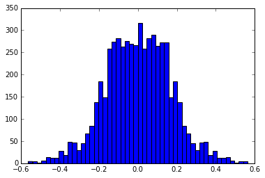
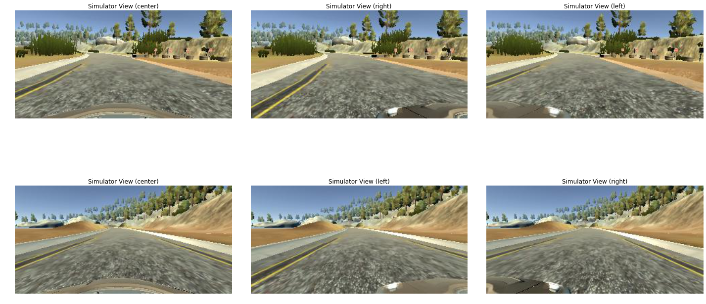
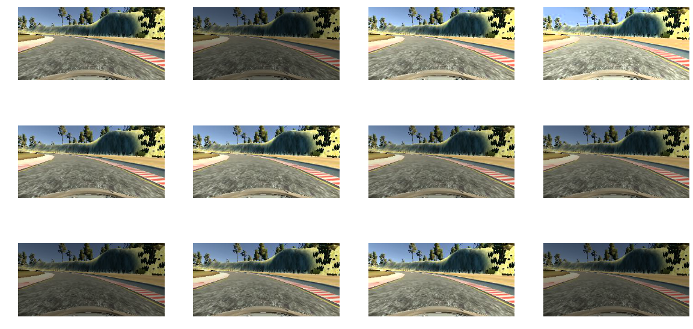
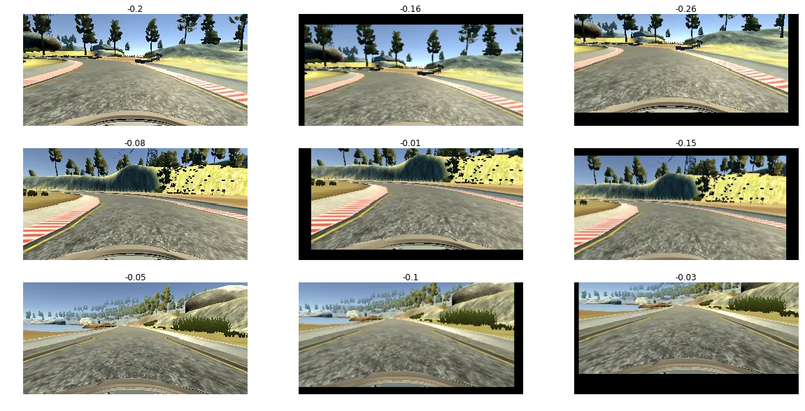
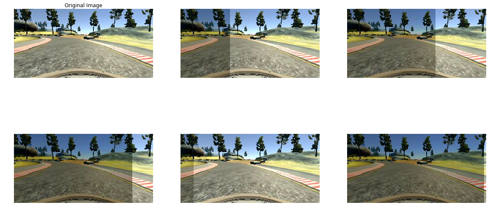

# **Behavioral Cloning Project**

## Overview

In this project, I will implement deep learning to efficiently teach a car to drive automatically in a driving simulator provided by Udacity.
The techniques are called [Behavioral Cloning](https://link.springer.com/content/pdf/10.1007%2F978-1-4899-7687-1_69.pdf), which definition is:

      Behavioral cloning is a method by which human subcognitive skills can be captured and reproduced in a computer program. As the human subject performs the skill, his or her actions are recorded along with the situation that gave rise to the action. A log of these records is used as input to a learning program. The learning program outputs a set of rules that reproduce skilled behavior. This method can be used to construct automatic control systems for complex tasks for which classical control theory is inadequate. It can also be used for training.

The CNN I used was based on NVIDIA's [End to End Learning for Self-Driving Cars](https://arxiv.org/pdf/1604.07316v1.pdf) paper with dropout for avoiding overfitting. 
Considering the training efficiency, I train my network on AWS most of the time.

## Data Collection and preprocessing
### Data Collection
In practice when we drive a car in real life, we also need to control the car to recover back in the middle of the road if it gets off the side of the road. So my automatic car needs to predict the steering angle when the car will run off to the side of the road and make a turn to come back in the middle of the road. so I created the scenario that I drove the car to wander off to the side of the road and then turn back to the middle. 
And if I used the keyboard to control vehicle, the distribute of steers will dominate at 0.0 like the following figure: 

However, if it was controlled by the mouse, the issue will be relieved in some way, like the following figure:

In summary, the strategy for collecting data is the following:
   * 2 laps for normal clockwise driving
   * 2 laps for "recovery" driving. 

Furthermore, the real self-driving car has multiple cameras for recording images. From a different perspective of the camera, the steering angles would be different, which can be explained in below figure:

It is easy to draw a conclusion that for the left camera, the steering angle would be less than the steering angle from the cneter camera. From the right camera's perspective, the steering angle would be larger than the angle from the center camera. 

### Data Preprocess
From the above figures, we can see that there are some noise on the figures, such as trees, sky, rock, lake and so on. The thing we care about is the lane on the road. So I cropped the image to 60X180. And the images will like below:

And before augmenting data, it is necessary to check the distribution of steers. The original distribution of the data like the following:

It is easy to see that the number of steers located around 0.0 is much high than the rest of steers. If we feeding the data into our neural network, the model will tend to predict the vehicle go straight and have some difficulty to turn left/right. Therefore we need to remove some data located at steer 0.0. And the new distribution of data is below:

### Data Augmentation
#### Flipped images
Because there is more left turns in track 1, so the data captured by camera biased toward left turns, which might cuase the car will have some trouble on the right turn. the solution for the problem is that the data colloected by cameras will be flipped vertically, which neutralized the left turn bias. And steers will be the opposite.

The distribution of steers in my data set shows below 

#### Load left/right cameras' images
The purpose to introduce left/right cameras images is that images are captured by left/right cameras can simulate the scenario that vehicle drives off the road for both sides and recover to the center of the road. And correspondingly, steer values also need to be modified for both cameras. I added 0.25 on steer for left cameras and subtrated 0.25 on steer for the right cameras. The idea is that the vehicle need to move right under the left camera image and vehicle need to move left under right camera image.

#### Changing Brightness of images
In the reality, vehicle should handle different light conditions, such as day and night. I convert image's color space from RGB to YUV and scaling Y channel from 0.5 to 1.5 randomly in converted YUV image.
And image listed in following:

### Translating images
Shifting image vertically is to simulate the vehicle drive an up or downslope. And similarly, shifting image horizontally also simulate vehicle driving at a different position on the road, and the steer should be modified correspondingly according the position vehicle located at. If an image shift right, the steer will be added by 0.004 per pixel. And when image shift left, the steer will be subtracted by 0.004 per pixel.

### Randomly shadow images(inspired by .[Jeremy Shannon's POST]( https://github.com/jeremy-shannon/CarND-Behavioral-Cloning-Project))
We can image a scensrio that vehicle can drive through an area what is shadowed by trees or other builds. 

## Model Architecture
Instead of LeNet, in the project I implemented the model mentioned in NVIDIA's End to End Learning for Self-Driving Cars paper, the architecture like following figure:

I make some modification on the architecture to fit my application

| Layer                         |     Description                       |
|:---------------------:|:---------------------------------------------:|
| Input                 | 160x320x3 RGB image                                      A
| Cropping              | Crop top 60 pixels and bottom 20 pixels; output shape = 80x320x3 |
| Normalization         | Normalization pixel value = pixel value/255 - 0.5      |
| Convolution 5x5       | 5x5 kernel, 2x2 stride, 24 output channels, output shape = 38x158x24  |
| RELU                  |                                                       |
| Convolution 5x5       | 5x5 kernel, 2x2 stride, 36 output channels, output shape = 17x77x36   |
| RELU                  |                                                       |
| Convolution 5x5       | 5x5 kernel, 2x2 stride, 48 output channels, output shape = 7x37x48    |
| RELU                  |                                                       |
| Convolution 5x5       | 3x3 kernel, 1x1 stride, 64 output channels, output shape = 5x35x64    |
| RELU                  |                                                       |
| Convolution 5x5       | 3x3 kernel, 1x1 stride, 64 output channels, output shape = 3x33x64    |
| RELU                  |     
| Dropout               | 0.5 keep probability ||
| Flatten               | Input 3x33x64, output 6336    |
| Fully connected       | Input 6336, output 100        |
| Fully connected       | Input 100, output 50          |
| Fully connected       | Input 50, output 10           |
| Fully connected       | Input 10, output 1 (labels)   |

I uses keras to implement the above architecture. 
Because when networks flatten the parameters, the output size is 8848, the size is so large that it might cuase overfit on the network. So I add a dropout layer between Flattern and Fully connected Layers. I tried the keep possibility from 0.3 to 0.5 and the when the value is 0.5, the loss will be minimum.

## Training Model
The size of data is 16200 and I used 5 epoch and 32 batch size to train on 80% of total data with 20% left for validation. And I optimize mean squareD error(MSE) using ADAM optimizer. Becasue the total size of data is too huge for server's memory and the training process is very slow, so model.fit_generator() is used for speed up the process 

## Future Work
This project is so cool and funny and I am amazed how powerful the deep learning is!! Implementing the neural network was not that hard  for most of STEM studens or anyone who have coding knowledge. I think the most difficult part for the project is how collect and process data for your application. After finishing my project I searched the solution from other Udacity students, I am surprised that there are a lot of space to improve my model. 

      1. The steering angle distribution is very useful for decrese overfitting. Actually for track 1, most of time the steering angle is between -0.25 to 0.25, because the most driving was on relatively straight road. It would cause a overfit for driving straightly and car meet a problem for some curve. So the solution will be that collect more data with large steering angle and remove some data with less steering angle from dataset. 
      2. Other improvement like last project, traffic-sign-classifier. By using data augmentation methods, like roation, translation, changing brightness, flipping and so on to rubust our model. 
      

## Video Link

[Track one](https://youtu.be/80gsJnYg3L8)

